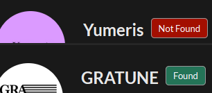

# VocaDBstuff

Collection of userscripts and utilities focused on VocaDB and NicoNico 

# How to install
- Install a userscript manager in your browser ([Violentmonkey](https://violentmonkey.github.io/) recommended).
- Open the `.user.js` file in the browser, you will be prompted to install

# Summary
- `artistonVDBcheck.user.js` — Add a "Scan on VocaDB" button to NicoNico user pages to find the artist on VocaDB.
- `exclam.user.js` — Replace the exclamation badge on VocaDB navigation with the real number of entry reports.
- `nicologtlhelper.user.js` — Translate parts of Nicolog pages (Japanese -> English)
- `piapro.user.js` — Adds a download button for Piapro songs so that they are still able to be downloaded even if the author disabled downloading
- `vocadbDisableGifs.user.js` — Disable GIF animation on VDB
- `vocadbEntryReportTimestamps.user.js` — Convert timestamps on VocaDB entry report pages from UTC/Japanese format to local time + relative times. (WIP!)
- `vocadbRemoveTeto.user.js` — Remove the April-Fools/Teto CSS if it is present on VocaDB.
- `vocalostutils.user.js` — A larger utility suite for NicoNico with quick links (archival, thumbnail, search) for videos and users.

Per-script documentation

# artistonVDBcheck.user.js

- Purpose: Adds a small badge to NicoNico user profile pages that searches VocaDB for the user (by artist name and profile URL). If an artist is found it links to the artist page, otherwise it links to the VocaDB artist creation page.
- Notes:
	- Button shows "Scanning…" while looking up results and changes color to show whether or not the artist was found

# exclam.user.js

- Purpose: Replace the small "!" badge in the VocaDB top navigation with the actual count
- Notes:
	- replace it with something useful

# nicologtlhelper.user.js
- Purpose: Provide translations and formatting improvements for Nicolog pages
- Behavior: Replaces many common Japanese UI strings with English equivalents and performs some date formatting.

# piapro.user.js
- Purpose: Add a "Download Song" button to Piapro pages when the creator has disabled regular downloading
- Notes:
  - if the song is downloadable normally, that will grant far better quality

# vocadbDisableGifs.user.js
- Purpose: Stop GIF animation on VocaDB 
- Notes:
	- not perfect with dom changes, will have to refresh for effect occassionally 

# vocadbRemoveTeto.user.js
- Purpose: Remove the TetoDB April Fools CSS from VocaDB pages. useful because the tetodb css was forced and broke ui features
- Notes:
	- no point unless the forced tetodb theme is active

# vocalostutils.user.js
- Purpose: Helper for NicoNico pages (watch and user pages) that provides a UI with links for archival, Search (VocaDB/Openlist/Archive.org/etc.), etc.

